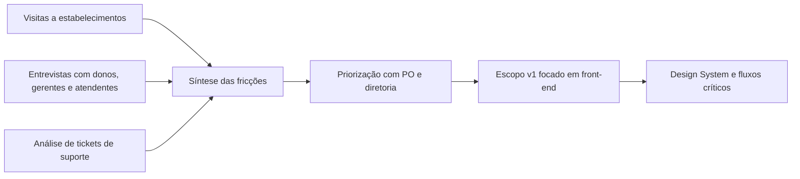
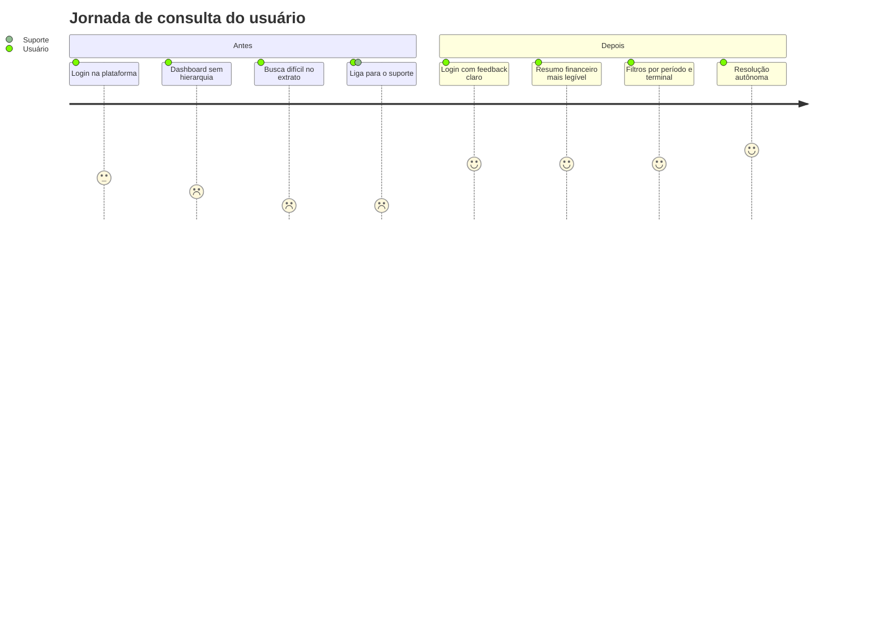
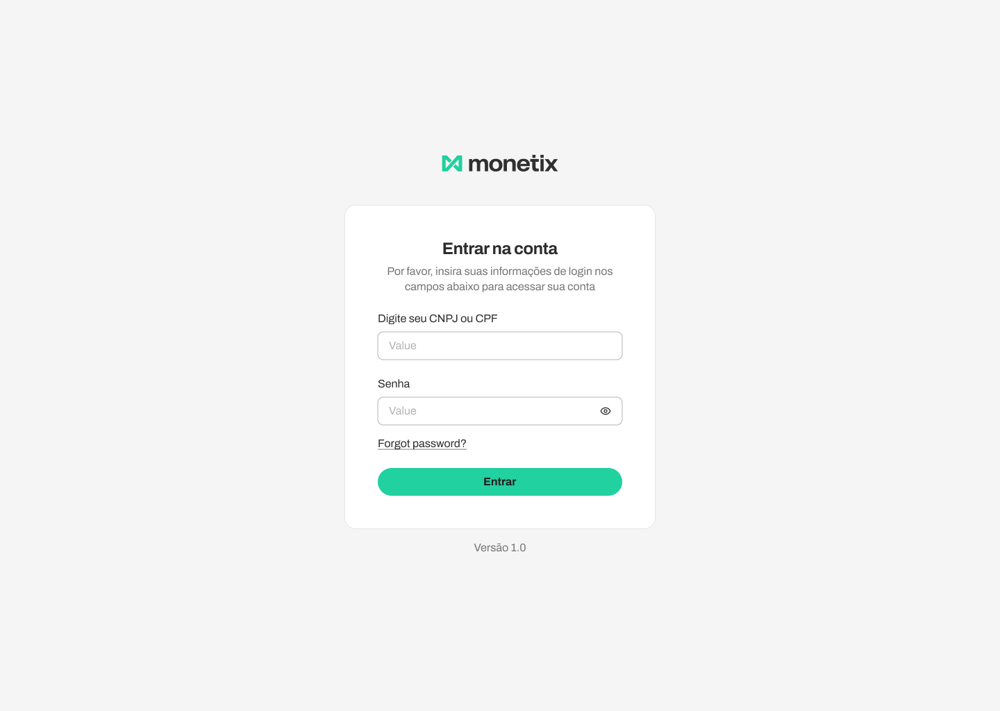
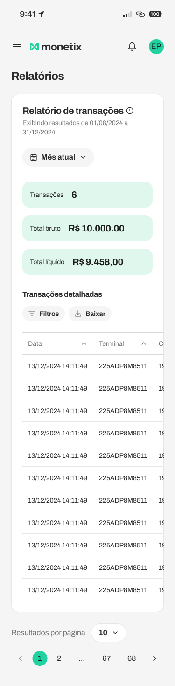

# Monetix — Redesign de uma plataforma financeira white label

## Visão geral

|  |  |
| --- | --- |
| Produto | Plataforma de gestão financeira B2B |
| Empresa | Irruba, em modelo white label |
| Plataformas | Web desktop, web mobile, iOS e Android |
| Meu papel | Product Designer, com atuação em pesquisa, arquitetura de informação, Design System e prototipação |
| Contexto | Produto legado com baixa usabilidade, alto volume de suporte e inconsistência visual |

A Monetix era usada por donos e gestores de pequenos negócios para acompanhar transações, recebíveis, conciliação bancária e operações ligadas às maquininhas de cartão. O desafio não estava na falta de funcionalidades. Estava no esforço cognitivo exigido para entender o que a plataforma estava tentando dizer.

Quando o usuário não conseguia interpretar por que o valor recebido era diferente do esperado, a consequência natural era recorrer ao suporte. Em um produto financeiro, isso não é apenas atrito de interface. É uma quebra de confiança.

## Contexto do produto e problema

O produto reunia diferentes frentes operacionais em um mesmo ambiente: transações, recebíveis, extrato por terminal, link de pagamento, download de planilhas e comunicados. Apesar da amplitude funcional, a experiência era frágil nos pontos em que clareza, contexto e legibilidade deveriam ser inegociáveis.

As dores mais recorrentes do material analisado convergiam para cinco sinais claros:

| Problema identificado | Efeito na experiência |
| --- | --- |
| Ausência de hierarquia visual | O usuário não entendia onde olhar primeiro |
| Uso indiscriminado do verde da marca | A cor deixava de orientar e passava a competir com tudo |
| Dados financeiros sem contexto | Bruto, líquido, taxas e períodos exigiam interpretação extra |
| Falta de um Design System | Cada tela parecia pertencer a um produto diferente |
| Bugs e inconsistências visuais | A interface transmitia instabilidade e pouca confiabilidade |

Essa combinação criava um ciclo ruim: telas densas, pouca orientação, leitura equivocada dos dados e aumento de chamados para o time de suporte.

> Em um produto financeiro, clareza não é acabamento. É infraestrutura de confiança.

## Objetivos e restrições

O redesign precisava responder a três frentes ao mesmo tempo: reduzir a dependência do suporte para tarefas recorrentes, reorganizar a leitura das informações financeiras e construir uma base visual sustentável para as próximas entregas.

Ao mesmo tempo, o projeto tinha limites operacionais bem definidos:

| Restrição | Impacto no projeto |
| --- | --- |
| Prazo curto | Exigiu priorização rigorosa da primeira versão |
| Time enxuto | Tornou inviável atacar muitos fluxos em paralelo |
| Mudanças de backend fora do escopo imediato | Forçou soluções concentradas em clareza, hierarquia e estados de interface |
| Regras de compliance do Banco Central | Limitou decisões de conteúdo, fluxo e apresentação dos dados |

Na prática, isso levou a um escopo v1 focado na camada de front-end e nos fluxos com maior impacto direto na compreensão dos dados.

## Papel do designer e escopo

Minha atuação não ficou restrita ao redesenho das telas finais. O trabalho combinou quatro frentes complementares:

1. Pesquisa em campo e síntese das principais fricções de uso.
2. Arquitetura de informação para reorganizar leitura, navegação e prioridades.
3. Criação do Design System que passaria a sustentar web e mobile.
4. Prototipação dos fluxos prioritários com alinhamento contínuo ao time técnico.

Esse escopo foi conduzido lado a lado com backend, PO, diretoria e suporte. A colaboração com o time técnico foi decisiva porque as restrições de API e de prazo afetavam diretamente o que poderia, de fato, ser resolvido na primeira entrega.

## Pesquisa e síntese

Antes de propor qualquer solução visual, a investigação combinou observação contextual, entrevistas e análise de tickets de suporte. A pesquisa não serviu apenas para confirmar dores. Ela ajudou a diferenciar o que era ruído pontual do que realmente comprometia a autonomia do usuário.

| Frente de pesquisa | O que foi feito | O que trouxe para o projeto |
| --- | --- | --- |
| Visitas a estabelecimentos | Observação do uso real em balcões, caixas e rotinas corridas | Contexto de uso e comportamento em ambiente operacional |
| Entrevistas com usuários | Conversas com donos, gerentes e atendentes | Diferenças de repertório, expectativa e linguagem |
| Análise de tickets de suporte | Leitura de tickets e reclamações recorrentes | Frequência e padrão das dúvidas mais críticas |
| Cruzamento qualitativo + quantitativo | Síntese entre campo e suporte | Base para priorização com impacto real |

Os perfis observados também deixavam claro que a plataforma era lida por pessoas com necessidades distintas:

| Perfil | Contexto de uso principal |
| --- | --- |
| Dono do negócio | Conferência de receitas, recebíveis e conciliação |
| Gerente | Acompanhamento por período, terminal e relatórios |
| Atendente | Operação cotidiana e consultas pontuais |

*Da pesquisa até a definição do escopo, o trabalho seguiu um encadeamento simples: observar, sintetizar, priorizar e só então desenhar.*

## Design System como infraestrutura

O problema não seria resolvido apenas redesenhando algumas telas. Antes disso, era preciso construir uma base de linguagem visual, comportamento e governança que impedisse o produto de voltar à inconsistência anterior.

| Camada | Função no projeto |
| --- | --- |
| Tokens de cor, tipografia e espaçamento | Organizar hierarquia visual e uso semântico da interface |
| Grid e regras de composição | Garantir consistência entre web e mobile |
| Componentes base e estados | Reduzir retrabalho e padronizar decisões recorrentes |
| Governança de componentes | Sustentar evolução sem fragmentar a experiência |
| Handoff via Figma Dev Mode | Aproximar design e implementação |

Segundo o material do projeto, essa base contribuiu para cerca de 40% de redução no tempo de prototipação e aproximadamente 90% de reuso de componentes nas telas entregues.

## Decisões de design

O redesenho foi menos sobre “modernizar a interface” e mais sobre reorganizar a lógica de leitura do produto.

| Decisão | Problema que atacava | Como aparecia na solução |
| --- | --- | --- |
| Restringir o verde da marca a ações e destaques | A cor estava em todo lugar e já não orientava nada | Uso semântico de cor em CTAs, estados e destaques |
| Criar hierarquia tipográfica para dados financeiros | Tudo tinha o mesmo peso visual | Separação clara entre total, subtotal, detalhe e apoio |
| Levar contexto para perto do número | O usuário via valores sem entender origem, período ou diferença | Labels, filtros, agrupamentos e distinção entre bruto, líquido e taxas |
| Projetar estados além do happy path | Erros, vazios e confirmações não estavam resolvidos | Login com erro, estados de confirmação e navegação mais previsível |
| Construir o Design System antes de expandir telas | A inconsistência voltava a cada nova entrega | Tokens, componentes base e governança para web e mobile |

## Evolução visual e fluxos

Em vez de usar um volume grande de telas, a leitura do case fica mais forte quando a evolução é mostrada por poucos pontos de prova: entrada, interpretação dos dados, ativação de funcionalidade e gestão operacional.

*A jornada resume a principal mudança do projeto: sair de uma experiência que dependia de mediação humana para uma interface que explicava melhor o que estava acontecendo.*

### Entrada e estados críticos

O fluxo de login passou a comunicar estado com mais clareza, reduzindo ambiguidade já no primeiro contato com a plataforma. Isso é relevante porque erros de autenticação, redefinição de senha e mensagens pouco claras costumam contaminar a percepção de confiança antes mesmo da leitura dos dados financeiros.

*Tela de login com hierarquia mais clara, menor ruído visual e CTA principal mais evidente.*

*Estado de erro com feedback contextual, reforçando a decisão de desenhar fluxos além do happy path.*

### Interpretação de extrato e recebíveis

O fluxo de extrato e recebíveis concentrava uma parte importante da fricção original. A decisão de explicitar período, agrupamento e leitura dos valores atacava justamente o tipo de dúvida que antes era desviado para o suporte.

*Exemplo de tela do fluxo de extrato, usado aqui como prova da reorganização da informação e do ganho de contexto junto aos valores.*

### Ativação de funcionalidade com compliance visível

O fluxo de link de pagamento precisava resolver exigências regulatórias sem transformar o processo em uma barreira. O simulador de taxas ajuda a mostrar como conteúdo, regra de negócio e clareza visual foram tratados como a mesma conversa.

*Tela de simulação e leitura de taxas, relevante para mostrar como a interface passou a explicar melhor as condições da operação.*

### Gestão operacional dos terminais

Além dos relatórios, o redesign também precisava organizar a leitura de estados operacionais. A tela de terminais reforça o papel do projeto em transformar densidade informacional em leitura prática.

*Gestão de terminais com status, localização e taxas negociadas organizados de forma mais legível para o gestor.*

## Resultados

Os resultados registrados no material do projeto se dividem em duas frentes: efeito percebido na operação e ganho de eficiência no processo de design.

### Resultados qualitativos

| Resultado observado | Como apareceu |
| --- | --- |
| Redução de chamados sobre extrato e recebíveis | Feedback direto do time de suporte após o lançamento da v1 |
| Menor dependência de mediação humana | Usuário conseguia interpretar melhor os dados na própria interface |
| Reuso do sistema visual em novas entregas | Design System passou a orientar evoluções posteriores |

### Resultados quantitativos ligados ao Design System

| Métrica | Resultado |
| --- | --- |
| Redução no tempo de prototipação | Aproximadamente 40% |
| Reuso de componentes nas telas entregues | Aproximadamente 90% |

O material não traz volume absoluto de tickets nem baseline numérica de suporte. Por isso, o case sustenta a redução de chamados como resultado qualitativo observado, e não como claim quantitativo fechado.

## Aprendizados

| Aprendizado | O que ele significou no projeto |
| --- | --- |
| Design System é infraestrutura de produto | Construir a base antes das telas foi o que tornou o redesign sustentável |
| Pesquisa de campo não é etapa ornamental | Os tickets mostravam o sintoma; a observação e as entrevistas explicavam a causa |
| Restrição técnica é dado de projeto | O escopo ficou melhor quando passou a respeitar backend, prazo e compliance desde o início |
| Colaboração entre times é parte da solução | Backend, suporte, PO e diretoria influenciaram diretamente a qualidade e a viabilidade do redesign |

Se eu iterasse esse trabalho hoje, acrescentaria uma camada mais robusta de instrumentação comportamental para medir com mais precisão onde ainda existiam hesitações, cliques sem sucesso ou dúvidas residuais. Isso ajudaria a transformar parte do aprendizado qualitativo em leitura quantitativa mais fina.

---

*Kayro Gomes · Product Designer*
