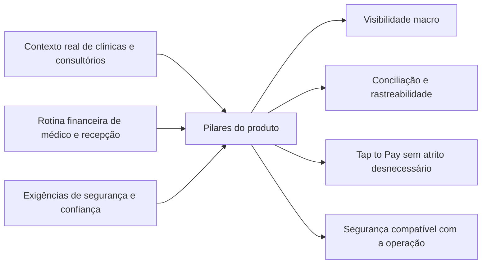
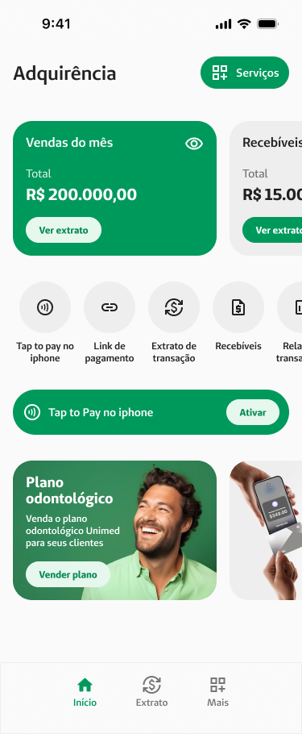
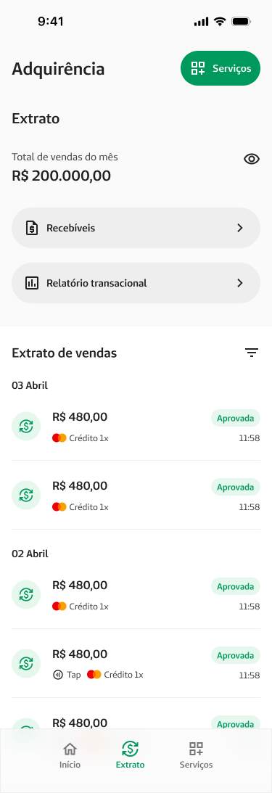
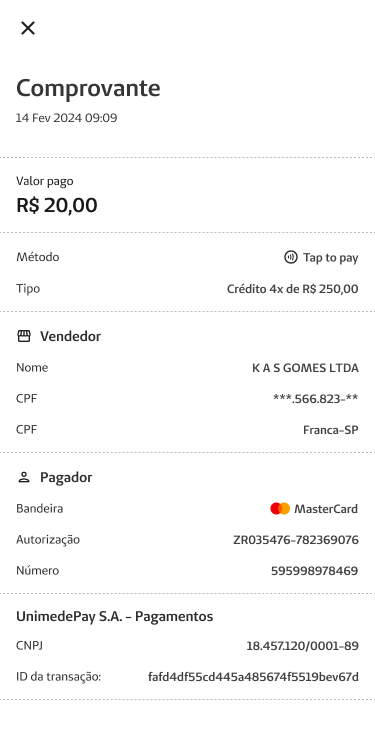
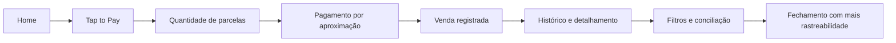

# UnimedPay — uma carteira digital desenhada para o ritmo da saúde

## Visão geral

|  |  |
| --- | --- |
| Produto | Carteira digital e gestor financeiro para profissionais da saúde, clínicas e hospitais |
| Marca | UnimedPay |
| Plataforma evidenciada | Aplicativo mobile |
| Meu papel | Product Designer end-to-end |
| Foco do projeto | Pagamento por aproximação no celular, vendas, extrato, filtros e segurança operacional |
| Contexto | Produto novo, concebido para resolver a rotina financeira específica do setor de saúde |

O UnimedPay nasce da interseção entre Fintech e Healthtech. A ambição do produto não era lançar mais uma conta digital genérica, mas construir uma ferramenta financeira capaz de acompanhar o ritmo real de clínicas, consultórios e hospitais.

Nesse contexto, receber dinheiro não é apenas registrar uma entrada. É conciliar transações, localizar vendas, fechar caixa, ler extrato, responder dúvidas operacionais e manter confiança em uma rotina em que atendimento e operação acontecem ao mesmo tempo.

O valor do produto, portanto, não estava em reproduzir o repertório de um banco digital. Estava em transformar complexidade financeira em legibilidade operacional.

## Contexto do produto e problema

Soluções financeiras generalistas atendem bem à lógica bancária. A rotina da saúde, porém, exige outra camada de clareza. O mesmo produto precisa responder à visão executiva do médico e à visão micro de quem está no balcão, conciliando recebimentos e fechando caixa em tempo real.

As informações compartilhadas sobre o projeto apontam para um problema central: ferramentas financeiras genéricas não davam contexto suficiente para explicar o dinheiro em uma operação de saúde.

| Fricção observada | Efeito na rotina |
| --- | --- |
| Movimentações tratadas de forma genérica | Dificuldade para entender origem, natureza e status dos recebimentos |
| Visão macro e visão operacional misturadas | O que é útil para o médico não é o mesmo que a recepção precisa no dia a dia |
| Fechamento de caixa dependente de conferência manual | Perda de tempo em uma rotina já pressionada |
| Falta de filtros e rastreabilidade imediata | Dúvidas recorrentes sobre lançamentos e conciliação |
| Segurança pouco adaptada ao contexto de uso | Etapas sensíveis podiam travar a operação em momentos críticos |

O projeto, então, precisava resolver duas tensões ao mesmo tempo: ser financeiramente confiável e operacionalmente ágil.

> No contexto da saúde, fluxo financeiro não é só transação. É continuidade operacional.

## Objetivos e restrições

Como produto novo, o UnimedPay precisava nascer com proposta clara. O trabalho não era só desenhar telas, mas organizar recebimento, visibilidade financeira e segurança como partes de uma mesma lógica de confiança.

Os objetivos do produto se concentravam em quatro frentes:

1. Tornar o recebimento mais simples para quem opera no dia a dia.
2. Dar visibilidade financeira mais clara para médicos e gestores.
3. Transformar Tap to Pay em uma experiência viável no celular, com o mínimo de fricção possível.
4. Organizar histórico, extrato, filtros e segurança como partes de uma mesma lógica de confiança.

Ao mesmo tempo, o projeto existia dentro de um ambiente sensível:

| Restrição | Impacto no produto |
| --- | --- |
| Nicho regulado | Decisões precisavam respeitar exigências financeiras e do setor de saúde |
| Contexto operacional intenso | A interface precisava funcionar em recepções, caixas e rotinas multitarefa |
| Segurança obrigatória | Proteção não podia comprometer agilidade em tarefas críticas |
| Complexidade do recebimento no setor | O produto precisava traduzir regras difíceis em leitura simples |

Essas restrições fizeram com que o design fosse menos sobre “embelezar a experiência” e mais sobre traduzir um sistema sensível em decisões compreensíveis na tela.

## Papel do designer e escopo

Minha atuação foi end-to-end, cobrindo o projeto do discovery à solução visual.

O trabalho combinou:

| Frente | Atuação |
| --- | --- |
| Discovery qualitativo | Imersão na rotina real de uso e leitura dos pontos de ansiedade financeira |
| Arquitetura de informação | Estruturação de home, vendas, extrato, filtros, segurança e fluxos críticos |
| UX transacional | Definição da lógica de Tap to Pay, conciliação, histórico e estados sensíveis |
| UI e prototipação | Materialização das decisões em fluxos mobile consistentes |
| Alinhamento entre áreas | Tradução entre necessidades de produto, segurança, operação e negócio |

Como o escopo era o produto completo, a solução precisou funcionar tanto para quem quer apenas uma visão consolidada quanto para quem precisa localizar uma venda específica sob pressão.

## Pesquisa e síntese

A base do projeto veio da observação da rotina real. Em produtos financeiros, o que as pessoas dizem nem sempre revela o que realmente trava a operação. Por isso, a investigação priorizou contexto de uso, ansiedade operacional e leitura das tarefas críticas.

O principal insight de síntese foi que o produto precisava servir a duas lógicas distintas:

| Perfil | O que procura no produto |
| --- | --- |
| Médico / cooperado | Visão macro, confiança e leitura rápida do que entrou e do que está disponível |
| Secretária / operação administrativa | Visão micro, rastreabilidade, filtros, prova de pagamento e fechamento de caixa |

Essa divisão influenciou a arquitetura do produto inteiro. O app precisava ser, ao mesmo tempo, executivo e operacional.

*A síntese do projeto apontou para quatro pilares inseparáveis: visibilidade, conciliação, velocidade operacional e segurança.*

## Decisões de design

O produto ganhou forma a partir de decisões que conectavam negócio, operação e leitura financeira.

| Decisão | Problema que resolvia | Como isso aparecia na experiência |
| --- | --- | --- |
| Estruturar a home como visão de negócio | Produtos financeiros tendem a começar pela conta; a operação da saúde precisa começar pela leitura | Home com entrada mais direta para visão geral e ações-chave |
| Tratar Tap to Pay como fluxo central, não periférico | O celular precisava assumir o papel de ponto de recebimento | Fluxo dedicado de pagamento por aproximação, com etapas claras e contexto transacional |
| Organizar vendas, extrato e detalhamento como sistema contínuo | Receber dinheiro e entender dinheiro precisam conversar | Histórico, extrato e detalhamento conectados à lógica de rastreabilidade |
| Investir em filtros como ferramenta operacional | A recepção precisa responder perguntas específicas rapidamente | Filtros e recortes para localizar lançamentos com menos esforço |
| Tornar segurança parte da fluidez do produto | Proteção excessivamente rígida quebra operação | Fluxos de segurança e redefinição mais claros, sem perder percepção de proteção |

Em vez de pensar o app como uma sequência de telas isoladas, o projeto foi construído como um sistema compacto, mas coerente: receber, registrar, localizar, conferir e proteger.

## Evolução visual e fluxos

Como o UnimedPay foi concebido como produto novo, o case se apoia mais na arquitetura dos fluxos do que em comparações antes/depois. As telas disponíveis apontam para cinco blocos fundamentais: entrada do produto, recebimento via Tap to Pay, gestão de vendas, filtros operacionais e segurança.

### Home como ponto de leitura e ação

A home precisava abrir o produto com sensação de controle e encurtar o caminho para as tarefas mais importantes. Em um app como esse, tela inicial fraca significa navegação excessiva logo no primeiro minuto.

*A home organiza leitura de negócio e acesso rápido aos fluxos mais importantes do produto.*

### Tap to Pay como fluxo principal

O coração do produto está no pagamento por aproximação no celular. Aqui, a prioridade de design não era apenas “fazer funcionar”, mas tornar o fluxo confiável o suficiente para ser usado em ambiente real de atendimento.

*Tap to Pay aparece como capacidade central do produto, não como funcionalidade periférica.*

*A escolha de parcelas mostra como o produto precisava traduzir decisão financeira em uma interação simples e objetiva.*

### Vendas, extrato e prova operacional

Receber é apenas metade da tarefa. A outra metade é conseguir localizar, provar, filtrar e interpretar cada lançamento sem depender de planilhas ou suporte.

*O módulo de vendas sustenta histórico, extrato, relatório e detalhamento da venda.*

*Os filtros reforçam a proposta do produto como ferramenta de gestão, não apenas de transação.*

### Segurança sem ruptura da operação

Como o produto lida com dinheiro, segurança é parte da experiência principal. Mas, no contexto da saúde, ela não pode ser desenhada como se o usuário tivesse tempo sobrando. A interface precisa proteger sem transformar cada tarefa em fricção.

*A camada de segurança aparece como componente estrutural do produto, integrada ao restante da experiência.*

*O fluxo principal do produto conecta recebimento, registro e conferência sem quebrar a continuidade da operação.*

## Resultados

Vou tratar os números compartilhados por você como fatos do projeto, porque vieram como insumo direto da reconstrução do case.

### Impacto operacional

| Resultado | Leitura para o negócio |
| --- | --- |
| Fechamento de caixa reduzido de cerca de 1 hora para aproximadamente 10 minutos | Menos tempo gasto em conferência manual e mais fluidez para a equipe administrativa |
| Redução de 30% nos chamados ligados a “Dúvidas de Lançamento” ou “Onde está meu dinheiro?” | A interface passou a explicar melhor o que antes dependia de mediação humana |
| Aumento perceptível no NPS entre médicos cooperados | O produto ganhou valor por resolver dores específicas do setor, e não por imitar bancos generalistas |

### Leitura qualitativa

O efeito mais importante talvez não esteja só nos indicadores, mas no reposicionamento do produto: o UnimedPay deixa de parecer uma conta digital genérica e passa a se comportar como ferramenta financeira orientada à rotina da saúde.

## Aprendizados

| Aprendizado | O que isso significa na prática |
| --- | --- |
| Fintech de nicho vence pela leitura de contexto | O diferencial não está na lista de features, mas na aderência à rotina do setor |
| Segurança precisa ser percebida como proteção, não punição | Em operações críticas, UX de segurança ruim compromete adoção |
| Fluxo financeiro bom é aquele que explica o dinheiro | Receber, localizar e conciliar precisam fazer parte da mesma experiência |
| Produto para saúde exige linguagem operacional | O design precisa conversar com médicos e com quem fecha o caixa |

O UnimedPay reforça uma tese simples, mas poderosa: quando o produto entende o trabalho real do usuário, a interface deixa de ser um painel financeiro e passa a funcionar como instrumento de operação.
